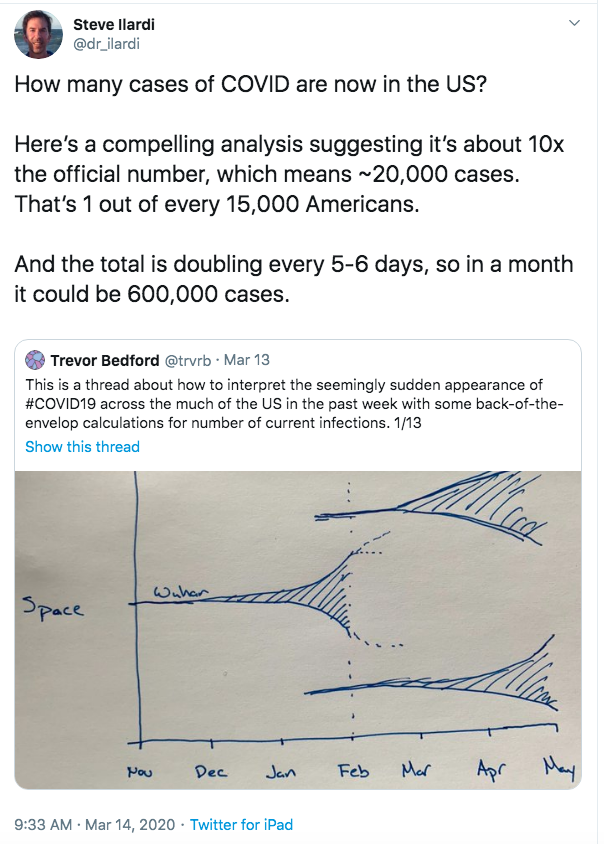
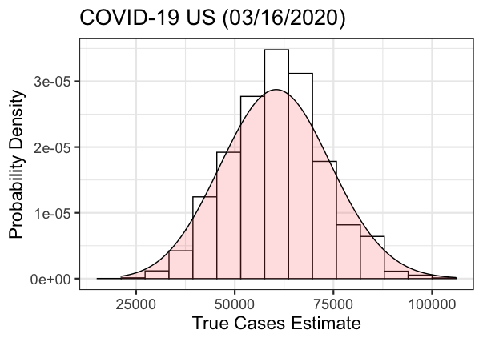

<B>DISCLAIMER:</B> This repository is not meant to provide public health policy recommendations. It is more educational than anything else. 

In this repository I will attempt to take a simulation approach on a method outlined by Trevor Bedford and picked up by Steve Illardi:



I took a purely simulation approach, based on the death cases, outlined as follows (of course parameters of the simulation are tunable once we have more data on them):

* <B>Estimate the time of COVID-19 contraction:</B> For each death, we simulate the day of the patient contracting the disease. According to some analysis from the <a href="https://github.com/midas-network/COVID-19">MIDAS network</a>, we can consider an average of 18 days from symptoms onset to death (with sd of 4 days). With an incubation period of about 6 days, this corresponds to 24 days from contraction to death. So for each death recorded on day X, we can sample its contraction day from a normal distribution with mean 24 and standard deviation 4 (if you are worried about the fact that normal distribution can take also negative values, you are right! You can use a log-normal with the appropriate parameters). 
* <B>Estimate number of cases on days of disease contraction: </B> For each simulated contraction day, let's refer to them as "confirmed contractions" - even though it should be clear that this is an abuse of terminology, we can get an estimate for the number of cases based on the case fatality rate of the disease. CFR is still fairly unknown, with an estimate of about 1% being used for countries with good healthcare system. We will add some uncertainty to this number, choosing the CFR for each simulation from a uniform distribution U(0.008, 0.012) (other possible choice is a -truncated - beta distribution). 
* <B>Laplace Smoothing: </B> If we have a day with not any confirmed contractions (as defined above), this does not mean that we do not have any contractions. For this we will use a techinique mimicking essentially <a href="https://en.wikipedia.org/wiki/Additive_smoothing">Laplace smoothing</a>. In particular, we consider there is a small number of confirmed contractions during that day (choosen randomly from a given range). 
* <B>Get an estimate of total cases up to the day of last contraction: </B> We can get a cumsum of the cases up to the day of last "confirmed contraction" (on average this will be 24 days back). 
* <B>Get an estimate of total cases today: </B> For this step one needs to consider the amount of days it takes for the cases to double. This will be small at the beginning of an outbreak, and most probably larger as measures are put in place (or large fraction of the population is already infected). We set as default 6 days for doubling the cases.

Data on the death cases are obtained from <a href="https://github.com/CSSEGISandData/COVID-19">Johns Hopkins database</a>.

You can use the ```R``` function ```covid19_trucases()``` to obtain the simulation results. 

For example, using the data for US up to 03/15/2020, the following is the distribution of true cases in the whole US based on the above simulation method (B=10000): 



